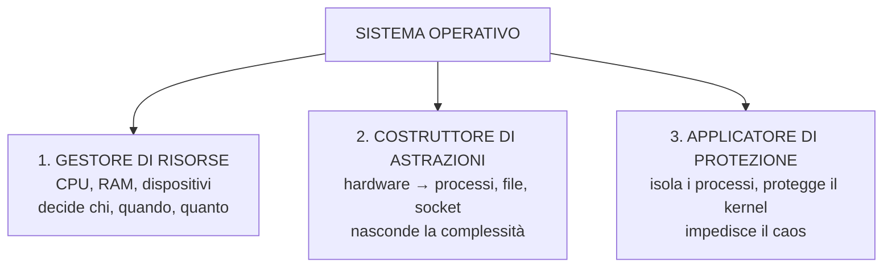
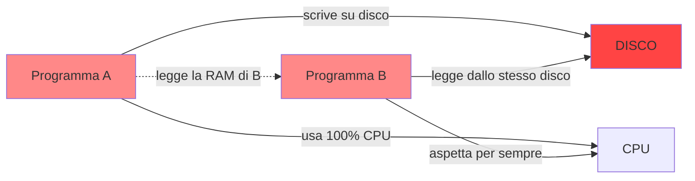
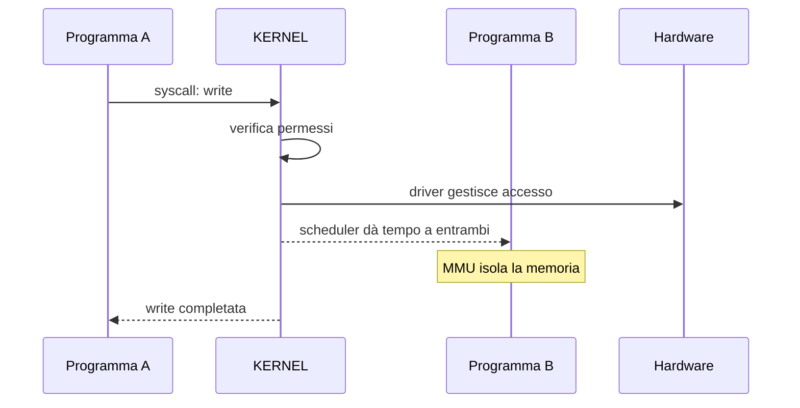

# 1. Che cos'è un sistema operativo

La domanda sembra semplice, ma "sistema operativo" significa cose diverse a seconda di chi parla.

Per chi usa il computer, è Windows o macOS. Per uno sviluppatore, è il kernel più le librerie di sistema. Per Sicania, serve una definizione precisa: il SO è il programma che **gestisce risorse, costruisce astrazioni e applica protezioni**.

## I tre ruoli

Questi tre ruoli sono ciò che **tu implementerai in Sicania** capitolo dopo capitolo: scheduler e allocatore (ruolo 1), file system e socket (ruolo 2), ring e memoria virtuale (ruolo 3).

## Senza SO

Ogni programma farebbe quello che vuole. Non esisterebbero ordine, isolamento, priorità. Basta un programma scritto male per far crashare tutto.

## Con SO

Il kernel si mette **in mezzo** a ogni operazione. Decide se un programma può fare cosa, in che ordine, per quanto tempo. È l'unico che si fida dell'hardware; i programmi si fidano solo del kernel.

## Ruolo 1 — Gestore di risorse

L'hardware ha capacità finite. Il SO decide chi usa cosa, quando e per quanto tempo.

| Risorsa | Problema | Soluzione del SO |
|---------|----------|------------------|
| CPU | 1 CPU, N processi | scheduling: a turno |
| RAM | limitata, contesa | memoria virtuale, protezione |
| Disco | accesso lento, condiviso | filesystem, cache, journal |
| Rete | pacchetti in arrivo casuale | stack di rete, socket |

**In Sicania:** lo scheduler assegnerà la CPU ai thread, l'allocatore gestirà la RAM, il driver seriale sarà il primo gestore di dispositivi.

## Ruolo 2 — Costruttore di astrazioni

L'hardware è scomodo. Il SO costruisce astrazioni per lavorare a un livello più alto.

| Hardware | Astrazione |
|----------|------------|
| CPU + timer | processo / thread |
| RAM | memoria virtuale |
| disco (settori) | file / directory |
| scheda di rete | socket |
| schermo + tastiera | terminale |

**In Sicania:** la seriale è la prima astrazione (un COUT hardware), la memoria virtuale arriverà col paging, i processi con lo scheduler.

## Ruolo 3 — Applicatore di protezione

Il SO impedisce che un programma ne danneggi un altro (o il kernel).

| Meccanismo | Cosa impedisce |
|------------|----------------|
| 2 livelli di privilegio (ring) | kernel non accessibile dallo spazio utente |
| memoria virtuale | un processo non vede la RAM altrui |
| syscall | ogni richiesta viene validata |

**In Sicania:** la GDT definisce i livelli di privilegio, il paging isolerà i processi, le syscall saranno l'unico ingresso nel kernel.

Questi tre ruoli (risorse, astrazioni, protezione) sono il nucleo di qualunque sistema operativo. Sicania li implementa tutti. Il resto del libro è su come.
