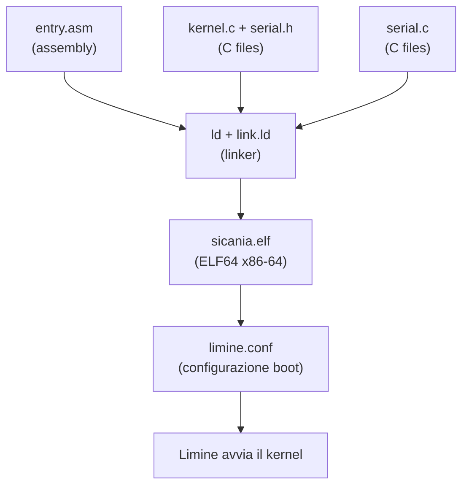
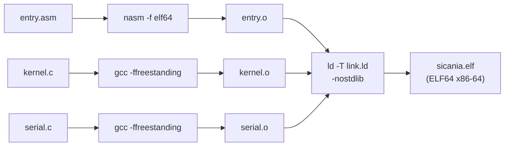

# 2. Struttura del progetto

Il kernel è composto da file organizzati per funzione. Ogni file ha un ruolo preciso nella catena che va dal bootloader al kernel operativo.

## Albero delle dipendenze



## Struttura directory

```
sicania/
│
├── limine.conf                    # configurazione del bootloader
│                                  # dice: "cerca il kernel a boot:/sicania.elf"
│
├── meson.build                    # build system principale
│                                  # definisce il progetto C "sicania"
│
├── kernel/
│   ├── meson.build                # build del kernel
│   │                              # flags: -ffreestanding -mno-red-zone ...
│   │
│   ├── kernel.c                   # entry point C del kernel
│   │                              # chiamata da entry.asm
│   │                              # chiama serial_init, serial_write_string
│   │
│   ├── serial.c                   # driver seriale
│   │   serial.h                   # UART 16550 a 0x3F8
│   │                              # funzioni: init, write_char, write_string
│   │
│   ├── limine.h                   # strutture del protocollo Limine
│   │                              # request, response, ID delle richieste
│   │
│   └── arch/
│       └── x86_64/
│           ├── meson.build        # riferimenti a entry.asm e link.ld
│           │
│           ├── boot/
│           │   └── entry.asm      # entry point assembly
│           │                      # _start: stack + call kernel_main
│           │
│           └── link.ld            # linker script
│                                  # ENTRY(_start)
│                                  # higher half: 0xFFFFFFFF80000000 + ...
│                                  # sezioni: .text .rodata .data .bss
│
└── tools/                         (futuro: script di test, debug, creazione ISO)
```

## Flusso di compilazione



## Creazione directory

```
mkdir -p kernel/arch/x86_64/boot
mkdir -p tools
```

Poi creeremo ogni file seguendo l'ordine delle specifiche.
