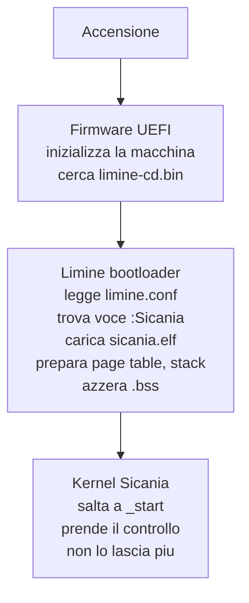

# 3. Configurazione di Limine

Limine ha bisogno di sapere dove si trova il kernel e con quale protocollo caricarlo. Queste informazioni si scrivono in `limine.conf`.

## Formato del file

```
TIMEOUT=0

:Nome voce
    PROTOCOL=limine
    KERNEL_PATH=boot:/kernel.elf
```

Il file ha una sezione globale (`TIMEOUT`) e una o più voci di boot (che iniziano con `:`).

## Specifica della configurazione

| Direttiva | Valore per Sicania | Descrizione |
|-----------|-------------------|-------------|
| `TIMEOUT` | `0` | secondi di attesa prima del boot automatico. `0` = immediato |
| Voce | `:Sicania` | nome visualizzato nel menu di boot |
| `PROTOCOL` | `limine` | protocollo nativo Limine |
| `KERNEL_PATH` | `boot:/sicania.elf` | percorso del kernel ELF dentro l'immagine |

### TIMEOUT

```
TIMEOUT=0   → avvia immediatamente (sviluppo)
TIMEOUT=5   → mostra menu per 5 secondi (debug/produzione)
```

Durante lo sviluppo vogliamo `0` per non aspettare. In futuro, con più voci di boot (kernel normale, modalità provvisoria, test), lo imposteremo a qualche secondo.

### PROTOCOL

Limine supporta diversi protocolli di boot:

| Protocollo | Uso |
|------------|-----|
| limine | protocollo nativo (usiamo questo) |
| multiboot2 | compatibilità con GRUB |
| stivale | protocollo alternativo leggero |

Noi usiamo `limine`, che dà accesso a tutte le funzionalità: mappa memoria, moduli, framebuffer, ACPI, SMBIOS, ecc.

### KERNEL_PATH

Il percorso è relativo alla radice del filesystem dell'immagine ISO:

| Percorso | Posizione nell'ISO |
|----------|-------------------|
| `boot:/sicania.elf` | `/boot/sicania.elf` |
| `:/kernel.elf` | `/kernel.elf` |
| `boot:/sub/dir/kernel.elf` | `/boot/sub/dir/kernel.elf` |

Noi useremo `boot:/sicania.elf`. Il kernel va copiato in `iso/boot/sicania.elf` quando creiamo l'immagine.

## Catena del boot con Limine



## Relazioni

```
limine.conf
    │
    ├── PROTOCOL=limine     → richiede che il kernel usi il protocollo Limine
    ├── KERNEL_PATH=...     → il kernel deve essere copiato in ISO/boot/
    └── ENTRY=_start        → il linker script deve definire _start
```

## Rischi

- **Percorso sbagliato**: se `KERNEL_PATH` non corrisponde alla struttura ISO, Limine non trova il kernel
- **Protocollo errato**: se usiamo `PROTOCOL=multiboot2` ma il kernel parla Limine, il boot fallisce
- **Timeout alto in sviluppo**: se dimentichiamo `TIMEOUT=0`, perdiamo 10 secondi a ogni boot
- **Formato del file**: spazi, tab, maiuscole/minuscole contano. Seguire esattamente il formato documentato
