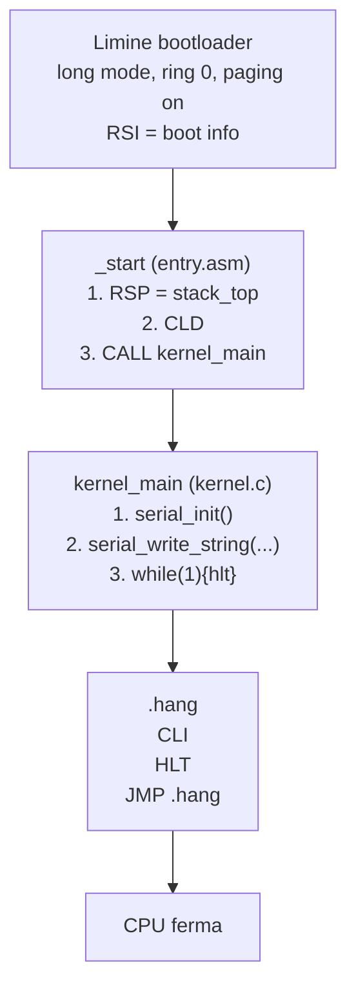

# 5. Entry point assembly

L'entry point è la prima istruzione eseguita dal kernel. È il punto in cui il bootloader salta. Deve essere scritto in assembly perché il C non può impostare lo stack pointer.

## Diagramma del flusso



## Funzioni

### `_start`

L'unica funzione pubblica dell'entry point. Chiamata direttamente da Limine.

```
_start:
    mov rsp, stack_top    ; imposta stack pointer
    cld                   ; azzera direction flag
    call kernel_main      ; passa al C
    cli                   ; (se torna) disabilita interrupt
.hang:
    hlt                   ; ferma CPU
    jmp .hang
```

| Proprietà | Valore |
|-----------|--------|
| Scopo | punto di ingresso del kernel |
| Parametri | RSI = boot info (trasparente per ora) |
| Restituisce | non ritorna mai |
| Chiama | `kernel_main` |
| Dipende da | Limine salta qui con CPU in long mode, ring 0 |

### Stack

Lo stack è riservato nel `.bss`:

```
section .bss
stack_bottom:
    resb 16384        ; 16.384 byte = 16 KB
stack_top:
```

| Proprietà | Valore |
|-----------|--------|
| Dimensione | 16 KB |
| Collocazione | sezione `.bss` (zero-inizializzata) |
| Direzione | cresce verso il basso (RSP decrementa) |
| Allineamento | 16 byte (garantito da `.bss` e linker) |

### `_start` vs `kernel_main`

| Proprietà | `_start` | `kernel_main` |
|-----------|----------|---------------|
| Linguaggio | assembly | C |
| RSP | imposta RSP | usa RSP (grazie a _start) |
| DF | normalizza DF | non tocca DF |
| Ritorno | non ritorna | non deve ritornare |
| Chiama | kernel | serial_init, serial_write |
| Panic | gestisce panic | (nessun panic, è il panic) |

## Convenzioni ABI all'ingresso

Limite garantisce questo stato quando salta a `_start`:

| Registro / Stato | Valore | Perché |
|------------------|-------|--------|
| Modalità CPU | long mode 64 bit | dobbiamo operare a 64 bit |
| Privilegio (CPL) | ring 0 | possiamo fare tutto |
| Paging | attivo, 4 livelli | già mappato da Limine |
| IF (interrupt flag) | 0 (disabilitati) | nessun interrupt inatteso |
| DF (direction flag) | 0 (forward) | CLD già eseguito da Limine |
| RSP | allineato a 16B | chiamate C funzionano |
| RSI | puntatore boot info | da salvare se serve |
| Red zone | NON disponibile | compilerà con -mno-red-zone |
| SIMD/FPU | NON disponibile | compilerà con -mno-sse |

## Perché l'entry point fa solo questo

L'entry point è **minimale per progettazione**. Fa solo lo stretto necessario:

1. **Imposta RSP**: il C non può modificare lo stack pointer
2. **Azera DF**: il compilatore assume sempre DF=0
3. **Chiama kernel_main**: tutto il resto lo fa il C

Tutto ciò che potrebbe andare storto prima di `kernel_main` è gestito da Limine. Noi ci fidiamo di Limine per lo stato base e ci concentriamo sul nostro codice.

## Evoluzione futura

In futuro l'entry point farà anche:

- salvare RSI (boot info) prima che `kernel_main` lo sovrascriva
- eseguire una validazione minima del contratto di boot (magic, versione)
- installare uno stack di emergenza per i fault precoci
- inizializzare la diagnostica più precoce (prima di chiamare C)

Ma per ora, questa semplicità è sufficiente.

## Rischi

| Rischio | Conseguenza | Prevenzione |
|---------|-------------|-------------|
| Stack non allineato 16B | crash in funzioni C che usano SSE | Limine garantisce allineamento, ma in futuro verificheremo |
| DF=1 | memcpy e stringhe al contrario | `cld` all'inizio |
| Red zone usata | interrupt corrompe dati sotto RSP | flag `-mno-red-zone` del compilatore |
| `kernel_main` ritorna | CPU in loop con interrupt disabilitati | `cli; hlt; jmp .hang` |
