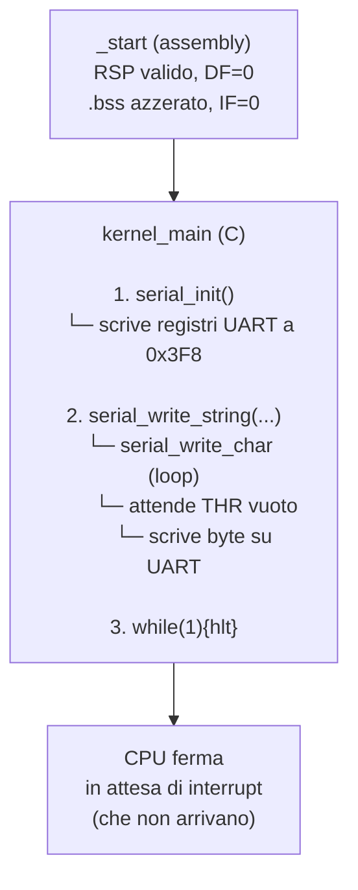
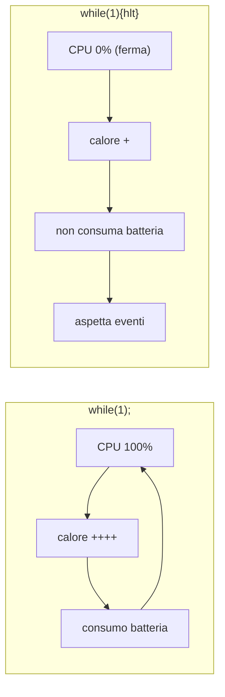

# 6. Il kernel in C

Il cuore del kernel è una funzione C chiamata dall'assembly. Per ora fa una cosa sola: inizializza la seriale, stampa un messaggio, ferma la CPU.

## Diagramma del flusso



## Funzioni

### `kernel_main()`

```
void kernel_main(void)
```

| Proprietà | Valore |
|-----------|--------|
| Scopo | entry point C del kernel |
| Parametri | nessuno (per ora) |
| Restituisce | void (non deve mai tornare) |
| Operazioni | 1. `serial_init()` → configura UART |
| | 2. `serial_write_string(...)` → stampa messaggio |
| | 3. `while(1) { hlt }` → ferma CPU |
| Dipende da | stack valido, `.bss` azzerato, DF=0 |
| Chiama | `serial_init`, `serial_write_string` |
| Usata da | `_start` (entry assembly) |

### Perché il loop con `hlt`

```
while(1) { __asm__("hlt"); }
```

Il comando `hlt` ferma la CPU fino al prossimo interrupt. A differenza di un semplice `while(1);` (che consuma CPU al 100% in un loop attivo), `hlt` consuma il minimo.



Quando avremo interrupt (timer, tastiera), la CPU si risveglierà automaticamente da `hlt` e potremo fare cose utili. Per ora, senza interrupt, la CPU resta ferma per sempre.

### Perché nessun parametro

Il bootloader passa informazioni di boot (mappa memoria, moduli, indirizzi). Per ora le ignoriamo. `kernel_main` ha segnatura `void(void)`.

Quando serviranno, riceverà un puntatore a `boot_info` (o userà le strutture Limine) e inizializzerà il resto del kernel.

## Specifiche di sistema richieste

Prima che `kernel_main` venga chiamata, queste condizioni devono essere vere:

| Condizione | Garantita da | Verificata da |
|------------|--------------|---------------|
| Stack valido e allineato | entry.asm (mov rsp) | convenzione ABI |
| .bss azzerato | Limine / bootloader | linker script |
| DF=0 | entry.asm (cld) | ABI Limine |
| Interrupt disabilitati | entry.asm (da Limine) | ABI Limine |
| Nessuna red zone | flag compilatore | meson.build |
| Nessun SIMD/FPU | flag compilatore | meson.build |
| Nessuna libreria C | flag compilatore | -ffreestanding |

## Gestione errori

`kernel_main` al momento non gestisce errori perché non ce ne sono:

- `serial_init()` configura registri fissi a un indirizzo fisso. Non fallisce.
- `serial_write_string()` itera una stringa costante. Non fallisce.
- `while(1){hlt}` non fallisce.

In futuro, quando `kernel_main` farà cose più complesse (allocare memoria, rilevare hardware, caricare moduli), ogni chiamata dovrà verificare il risultato e gestire il fallimento.

## Relazioni

```
_start
  │
  └── kernel_main()
        │
        ├── serial_init()           (configura UART)
        │     └── porta 0x3F8       (I/O)
        │
        └── serial_write_string()   (stampa messaggio)
              │
              └── serial_write_char() (scrive un byte)
                    └── porta 0x3F8   (I/O)
```

## Rischi

| Rischio | Conseguenza | Prevenzione |
|---------|-------------|-------------|
| `.bss` non azzerato | stack = spazzatura → crash immediato | Limite lo azzera, verificare con GDB |
| `serial_init` non chiamata | serial_write non funziona | ordine in kernel_main |
| Funzione ritorna | CPU in loop morto | entry.asm ha `cli;hlt` dopo la call |
| Flag compilatore sbagliato | red zone / SIMD corrompe stack | verificare meson.build |
