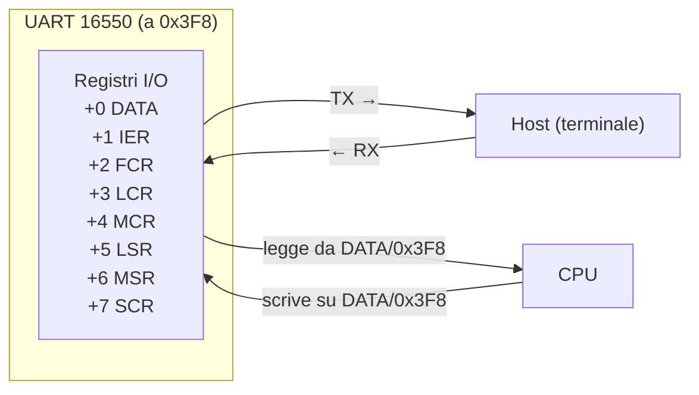
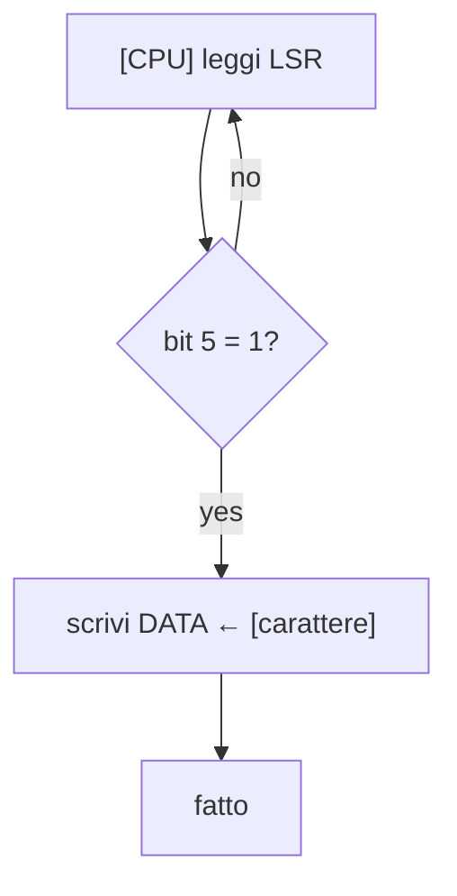

# 7. Driver seriale

La porta seriale (UART 16550) è il nostro primo e più importante strumento diagnostico. Permette di stampare messaggi dal kernel verso il terminale dell'host, senza bisogno di uno schermo o di driver grafici.

## La UART 16550



La 16550 è un chip presente su QEMU (e su hardware x86-64 standard). Comunica attraverso 8 registri di I/O a partire da `0x3F8` (COM1).

## Funzioni

### `serial_init()`

```
void serial_init(void)
```

Configura la UART per la comunicazione a 115200 baud, 8 bit, nessuna parità, 1 stop bit.

**Operazioni sui registri:**

```
Passo  Registro  Valore  Significato
─────  ────────  ──────  ─────────────────────────────
1      IER (+1)  0x00    disabilita tutti gli interrupt
2      LCR (+3)  0x80    attiva DLAB (baud rate divisor latch)
3      DATA (0)  0x01    divisore basso → 115200 baud
4      IER (+1)  0x00    divisore alto
5      LCR (+3)  0x03    DLAB off: 8 bit, no parity, 1 stop
6      FCR (+2)  0xC7    abilita FIFO, clear, soglia 14 byte
7      MCR (+4)  0x0B    DTR e RTS attivi
```

**Dipende da:** indirizzo I/O `0x3F8` accessibile in QEMU
**Usata da:** `kernel_main`

### `serial_write_char(c)`

```
void serial_write_char(char c)
```

Scrive un singolo byte sulla porta seriale.

**Operazioni:**

```
1. Leggi LSR (+5) finché bit 5 (THR empty) = 1
   while (!(port[5] & 0x20));

2. Scrivi il carattere in DATA (+0)
   port[0] = c;
```



**Dipende da:** `serial_init()` già eseguita
**Usata da:** `serial_write_string`

### `serial_write_string(str)`

```
void serial_write_string(const char *str)
```

Scrive una stringa terminata da `\0` sulla seriale.

**Operazioni:**

```
while (*str != '\0'):
    serial_write_char(*str)
    str++
```

**Dipende da:** `serial_init()` già eseguita
**Usata da:** `kernel_main`

### Nota su `\r\n`

La seriale ha bisogno di carriage return (`\r`) prima del newline (`\n`). Se usi solo `\n`, il cursore torna a capo ma non all'inizio della riga:

```
Solo \n:
    Sicania: kernel avviato con successo!
                        nuova riga qui ←
                        (non all'inizio)

Con \r\n:
    Sicania: kernel avviato con successo!
    nuova riga qui ←
    (all'inizio)
```

## Perché la seriale

La seriale è il metodo più semplice per ottenere output da un kernel:

| Vantaggio | Perché |
|-----------|--------|
| Semplice | 8 registri, nessun controller grafico |
| Senza interrupt | polling basta |
| Senza scheduler | scriviamo quando vogliamo, non c'è concorrenza |
| QEMU supporta | `-serial stdio` stampa sul terminale |
| Standard hardware | presente su QEMU, PC reali, server |

## Relazioni

```
kernel_main
  │
  ├── serial_init()
  │     └── [0x3F8] LCR, FCR, MCR, ...
  │
  └── serial_write_string("...\r\n")
        │
        └── serial_write_char(c)  [per ogni carattere]
              │
              └── [0x3F8] LSR (polling)
              └── [0x3F8] DATA (scrittura)
```

## Rischi

| Rischio | Conseguenza | Prevenzione |
|---------|-------------|-------------|
| `serial_init` non chiamata | UART non configurata, caratteri persi | chiamarla prima di write |
| Polling bloccante | CPU ferma durante scrittura | ok ora (solo una CPU, nessuna concorrenza) |
| Indirizzo `0x3F8` sbagliato | accesso a registro inesistente | QEMU ha COM1 a 0x3F8 |
| Stringa senza `\0` | stampa byte fino a trovare 0 | sempre stringhe C valide |
| `\r\n` dimenticato | output su una riga sola | ricordarsi \r prima di \n |
