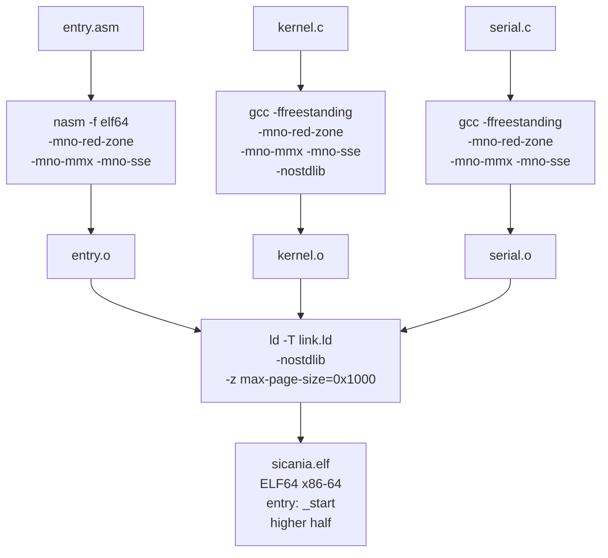

# 8. Build system

Il build system si occupa di compilare i file assembly e C, linkarli insieme e produrre un ELF x86-64 valido per il bootloader.

## Diagramma di compilazione



## Specifica del build system

### Obiettivi

| Obiettivo | Descrizione |
|-----------|-------------|
| Compilare `entry.asm` | nasm → `entry.o` (ELF64 x86-64) |
| Compilare `kernel.c` | gcc freestanding → `kernel.o` |
| Compilare `serial.c` | gcc freestanding → `serial.o` |
| Linkare tutto + link.ld | ld → `sicania.elf` |
| Prodotto finale | ELF64 x86-64 con entry point `_start` |

### Opzioni compilatore C

| Opzione | Spiega |
|---------|--------|
| `-ffreestanding` | nessuna libreria C (no printf, no malloc, no startup code) |
| `-mno-red-zone` | la red zone (128 byte sotto RSP) viene sovrascritta dagli interrupt. Nel kernel va disabilitata. |
| `-mno-mmx` | non usare registri MMX |
| `-mno-sse` | non usare registri XMM (non salviamo/ripristiniamo stato SSE) |
| `-mno-sse2` | idem per SSE2 |
| `-Wall -Wextra` | tutti i warning |
| `-O2` | ottimizzazione standard |

### Opzioni linker

| Opzione | Spiega |
|---------|--------|
| `-T link.ld` | usa il nostro linker script |
| `-nostdlib` | non cercare libc o startup code |
| `-z max-page-size=0x1000` | allinea sezioni a 4 KB, non a 2 MB |

### Opzioni assembler

| Opzione | Spiega |
|---------|--------|
| `-f elf64` | produce oggetto ELF64 x86-64 |

## Output

Il prodotto finale è `sicania.elf`:

```
$ file sicania.elf
sicania.elf: ELF 64-bit LSB executable, x86-64, version 1 (SYSV),
statically linked, not stripped

$ readelf -h sicania.elf | head
ELF Header:
  Class:                             ELF64
  Entry point address:               0xffffffff80100000
  ...

$ nm sicania.elf | grep _start
ffffffff80100000 T _start
```

## File di build

Meson richiede tre file:

```
sicania/
├── meson.build                (radice: definisce il progetto)
├── kernel/
│   ├── meson.build            (kernel: sorgenti e flag)
│   └── arch/x86_64/
│       └── meson.build        (x86_64: riferimenti a entry.asm e link.ld)
```

### `meson.build` radice

```
project('sicania', 'c',
    default_options: ['c_std=c17']
)
subdir('kernel')
```

Definisce il progetto C "sicania" e include il file `kernel/meson.build`.

### `kernel/arch/x86_64/meson.build`

Espone le variabili `entry` e `linker_script` per il build principale:

```
entry = files('boot/entry.asm')
linker_script = files('link.ld')
```

### `kernel/meson.build`

Il cuore della build. Definisce l'eseguibile `sicania.elf` con tutti i sorgenti e i flag:

```
subdir('arch/x86_64')   ← carica entry e linker_script

nasm = find_program('nasm')

elf = executable('sicania.elf',
    entry,                ← entry.asm
    'kernel.c',
    'serial.c',
    c_args: [
        '-ffreestanding',
        '-mno-red-zone',
        '-mno-mmx',
        '-mno-sse',
        '-mno-sse2',
        '-Wall', '-Wextra',
        '-O2',
        '-std=c99',
    ],
    link_args: [
        '-Wl,-T', linker_script,
        '-nostdlib',
        '-z', 'max-page-size=0x1000',
    ],
    nasm_args: ['-f', 'elf64'],
)
```

## Comandi di compilazione

```
# Prima configurazione
meson setup build

# Compilazione (da ripetere dopo ogni modifica)
ninja -C build

# L'ELF prodotto
build/kernel/sicania.elf
```

## Alternativa: Makefile

Lo stesso risultato si può ottenere con un Makefile. Meson aggiunge complessità iniziale ma:

- compilazione parallela automatica
- ricompilazione solo dei file modificati
- cross-compilazione nativa
- gestione dipendenze (file `.d`)
- integrazione test

Per i primi capitoli, se Meson sembra eccessivo, un Makefile di 15 righe può bastare. Passeremo a Meson quando il progetto crescerà.

## Rischi

| Rischio | Conseguenza | Prevenzione |
|---------|-------------|-------------|
| Manca `-mno-red-zone` | interrupt corrompe stack | doppio controllo meson.build |
| Manca `-ffreestanding` | linker cerca `__libc_init` → errore | flag obbligatorio |
| Manca `-T link.ld` | linker layout default → crash page fault | flag obbligatorio |
| Manca `-nostdlib` | linker cerca startup code → errore | flag obbligatorio |
| `nasm` non trovato | errore build | installare nasm |
| `meson setup` non eseguito | errore build | eseguire prima `meson setup build` |
