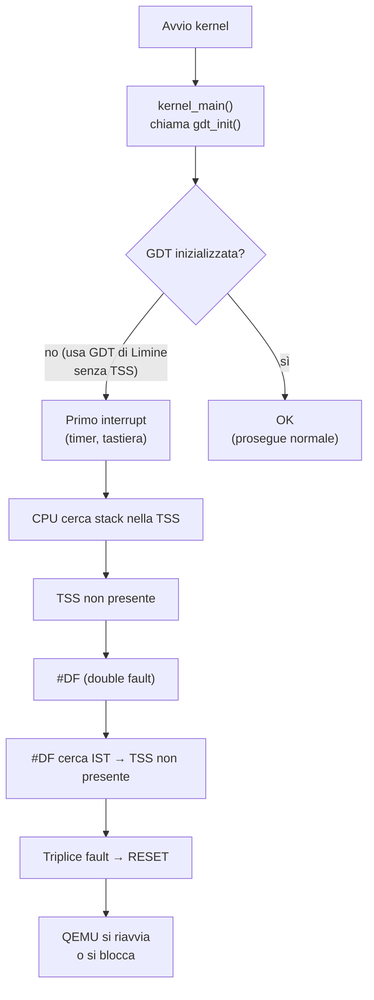
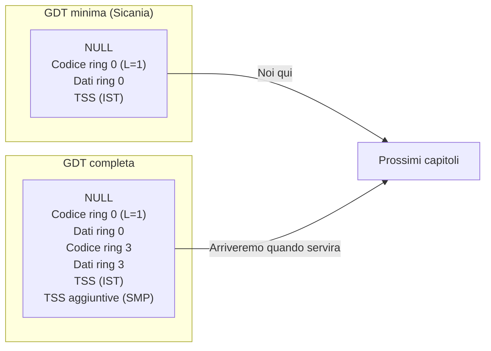

# 1. Perché serve la GDT in x86-64

In x86-64, la segmentazione della memoria è disabilitata: gli indirizzi logici coincidono con quelli virtuali, i limiti e le basi dei segmenti vengono ignorati. Tuttavia, la CPU **richiede comunque** una GDT valida per tre ragioni.

## Le tre ragioni

| # | Ragione | Spiegazione |
|---|---------|-------------|
| 1 | Privilegio (CPL) | Il CPL (Current Privilege Level) è determinato da CS.DPL (i bit 0-1 del segment selector). Senza un segmento codice valido, la CPU non sa a che livello girare. |
| 2 | Modalità long mode | Il bit L (long mode) nel descrittore del segmento codice dice alla CPU se operare in long mode o compatibility mode. Senza L=1, la CPU esegue codice a 32 bit e crasha sulla prima istruzione a 64 bit. |
| 3 | TSS per IST | Le eccezioni (double fault, page fault, general protection) hanno bisogno di uno stack pulito. La TSS definisce gli IST (Interrupt Stack Table), puntatori a stack separati per gestire i fault senza corrompere lo stack corrente. |

## Cosa succederebbe senza GDT



## Cosa fa la GDT di Sicania

```
Indice   Uso
──────   ──────────────────────────────────────────
0        NULL (obbligatorio: primo descrittore
         deve essere zero, o CPU genera #GP)
1        Segmento codice (ring 0, long mode,
         execute/read)
2        Segmento dati (ring 0, read/write)
3        TSS (Task State Segment) per IST
         (16 byte in formato sistema)
```

La nostra GDT è **minimale**: solo ciò che serve per il funzionamento corretto della CPU e per la futura gestione degli interrupt. Non abbiamo segmenti user (ring 3) perché Sicania non esegue ancora processi in user mode.

## Confronto



## Proprietà e invarianti

| Proprietà | Valore |
|-----------|--------|
| `gdt_init` deve essere chiamata prima di caricare IDT | sì |
| `gdt_init` deve essere chiamata una sola volta | sì |
| TSS deve essere inizializzata e presente nella GDT prima di `sti` | sì |
| Dopo `gdt_load`, il segmento CS deve puntare al descrittore codice ring 0 | sempre |
| I descrittori GDT non vengono mai modificati dopo `gdt_load` | sì (fino a SMP) |
