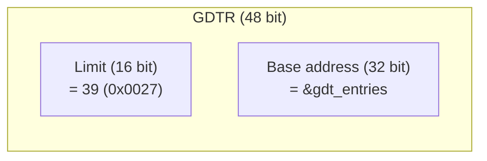

# 2. Formato dei descrittori

La GDT è un array di descrittori a 8 byte (per descrittori standard) o 16 byte (per descrittori di sistema come TSS in x86-64).

## Formato descrittore standard (8 byte)

```
Byte 0-1     Limit (bit 0-15)          ← ignorato in long mode
Byte 2-3     Base  (bit 0-15)           ← ignorato in long mode
Byte 4       Base  (bit 16-23)          ← ignorato in long mode

Byte 5       Access byte
                  7     6   5   4   3   2   1   0
                ┌─────┬───┬───┬───┬───┬───┬───┬───┐
                │  P  │DPL│DPL│ S │ E │DC │RW │ A │
                └─────┴───┴───┴───┴───┴───┴───┴───┘
                P    = Present (1 = valido)
                DPL  = Descriptor Privilege Level (0-3)
                S    = 0 = system, 1 = code/data
                E    = 0 = data, 1 = code
                DC   = data: direction; code: conforming
                RW   = data: writable; code: readable
                A    = Accessed (CPU lo imposta)

Byte 6       Flags (bit 4-7) + Limit (bit 16-19)
                ┌─────┬─────┬─────┬─────┬─────┬─────┬─────┬─────┐
                │  G  │  D  │  L  │AVL  │ Limit (bit 16-19)     │
                └─────┴─────┴─────┴─────┴─────┴─────┴─────┴─────┘
                G    = Granularity (1 = limit * 4KB, ignorato)
                D    = Default operation size (0 = 16 bit,
                       1 = 32 bit; ignorato in long mode)
                L    = Long mode (1 = codice a 64 bit; solo per
                       segmenti codice)
                AVL  = Available for system software

Byte 7       Base (bit 24-31)          ← ignorato in long mode
```

## I tre descrittori di Sicania

### NULL (indice 0)

```
Byte    Valore
──────  ──────
Tutti   0x00
```

Obbligatorio. La CPU si aspetta il primo descrittore = 0. Se non lo è, `lgdt` funziona ma un caricamento accidentale del selector 0 causa #GP.

### Codice ring 0 (indice 1, selector = 0x08)

| Campo | Valore binario | Significato |
|-------|---------------|-------------|
| Access byte | `10011010` | P=1, DPL=0, S=1, E=1(code), C=0(non-conf), R=1(readable), A=0 |
| Flags | `00100000` | G=0, D=0, L=1(long mode), AVL=0 |
| Limit | `0` | (ignorato) |
| Base | `0` | (ignorato) |

| Proprietà | Valore |
|-----------|--------|
| Presente | sì |
| DPL | 0 (kernel) |
| Eseguibile | sì |
| Leggibile | sì |
| Conforming | no |
| Long mode | sì (L=1) |

### Dati ring 0 (indice 2, selector = 0x10)

| Campo | Valore binario | Significato |
|-------|---------------|-------------|
| Access byte | `10010010` | P=1, DPL=0, S=1, E=0(data), W=1(writable), A=0 |
| Flags | `00000000` | G=0, D=0, L=0, AVL=0 |
| Limit | `0` | (ignorato) |
| Base | `0` | (ignorato) |

| Proprietà | Valore |
|-----------|--------|
| Presente | sì |
| DPL | 0 (kernel) |
| Scrivibile | sì |
| Espansione verso l'alto | sì (direzione su) |

## TSS (Task State Segment)

La TSS non è più un segmento attività come in x86-32. In x86-64 serve solo per:

1. **IST (Interrupt Stack Table)** — fino a 7 puntatori a stack separati. Ogni entry nella IDT può specificare quale IST usare (0 = nessuno, 1-7 = stack IST).
2. **I/O map** — permessi porta I/O (non ci serve subito).

### Struttura della TSS (104 byte)

| Offset | Dimensione | Campo |
|--------|------------|-------|
| +0 | 4 byte | riservato |
| +4 | 4 byte | RSP0 (lower) — stack per interrupt da ring 3 (futuro) |
| +8 | 4 byte | RSP0 (upper) |
| +12 | 4 byte | RSP1 (lower) |
| +16 | 4 byte | RSP1 (upper) |
| +20 | 4 byte | RSP2 (lower) |
| +24 | 4 byte | RSP2 (upper) |
| +28 | 4 byte | riservato |
| +32 | 4 byte | riservato |
| +36 | 4 byte | IST1 (lower) — stack per eccezioni critiche |
| +40 | 4 byte | IST1 (upper) |
| +44 | 4 byte | IST2 (lower) |
| +48 | 4 byte | IST2 (upper) |
| ... | ... | ... |
| +100 | 2 byte | I/O map base (0xFFFF = nessuna mappa) |
| +102 | 2 byte | riservato |

Inizialmente impostiamo solo **IST1** con uno stack dedicato per i fault critici (double fault, page fault). Gli altri campi sono zero.

### Descrittore TSS (16 byte)

```
Byte 0-1     Limit (bit 0-15)         = sizeof(tss) - 1 = 103 (0x0067)
Byte 2-3     Base  (bit 0-15)
Byte 4       Base  (bit 16-23)
Byte 5       Access byte              10001001 = P=1, DPL=0,
                                       S=0(sistema), Type=9(TSS disponibile)
Byte 6       Flags (4 bit) + Limit (4 bit alti)
Byte 7       Base  (bit 24-31)
Byte 8-11    Base  (bit 32-63)         ← solo per x86-64
Byte 12-15   riservato                 = 0
```

Il descrittore TSS è a **16 byte** (non 8) su x86-64 perché l'indirizzo di base è a 64 bit.

## Tabella GDT completa

| Indice | Selector | Descrizione | Formato | Byte totali |
|--------|----------|-------------|---------|-------------|
| 0 | `0x00` | NULL | 8 byte | 8 |
| 1 | `0x08` | Codice ring 0 (L=1) | 8 byte | 16 |
| 2 | `0x10` | Dati ring 0 | 8 byte | 24 |
| 3 | `0x18` | TSS | 16 byte | 40 |
| | | **Totale GDT** | | **40 byte** |

## Puntatore GDTR

Il registro GDTR si carica con `lgdt` e contiene:



Caricamento: `lgdt [gdtr_ptr]` dove `gdtr_ptr` punta a una struct { uint16_t limit; uint64_t base; }.

## Come si carica

```
struct gdtr {
    uint16_t limit;
    uint64_t base;    // in realtà solo 32 bit servono, ma per chiarezza
} __attribute__((packed));

    mov    rax, [gdtr]    // 48 bit caricabili con lgdt
    lgdt   [rax]
    
    push   0x08           // selector codice
    lea    rax, [.reload] // indirizzo di ritorno
    push   rax
    retfq                 // far return: CS = 0x08, RIP = .reload
.reload:
    mov    ax, 0x10       // selector dati
    mov    ds, ax         // tutti i segmenti dati
    mov    es, ax
    mov    fs, ax
    mov    gs, ax
    mov    ss, ax
```

Nota: dopo `lgdt`, bisogna ricaricare CS con un `retfq` (o `ljmp` a 64 bit) perché il descrittore CS non si può cambiare con un semplice `mov`.

## Rischi

| Rischio | Conseguenza | Prevenzione |
|---------|-------------|-------------|
| Descritore TSS a 8 byte invece di 16 | CPU legge 8 byte e interpreta male | in x86-64 usare sizeof(TSS) e 16-byte descriptor |
| IST senza stack valido | CPU scrive su indirizzo zero → page fault | verificare stack TSS sia in memoria valida |
| `lgdt` con indirizzo sbagliato | GDTR corrotto → #GP | indirizzo deve essere allineato |
| `retfq` con selector non valido | #GP | selector 0x08 (codice) |
| GDT non allineata | `lgdt` funziona ma prestazioni ridotte | allineare a 8 byte se possibile |
