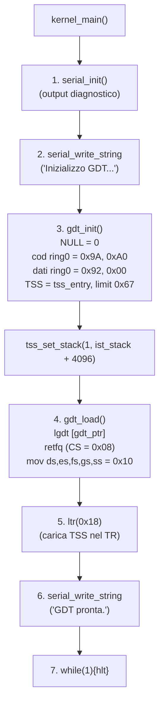
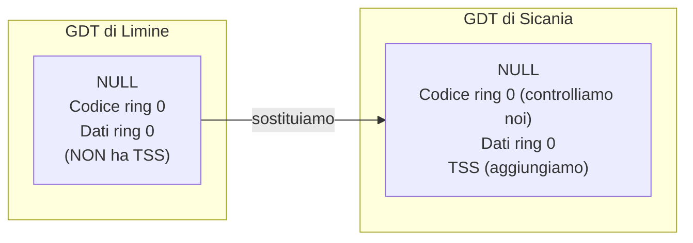
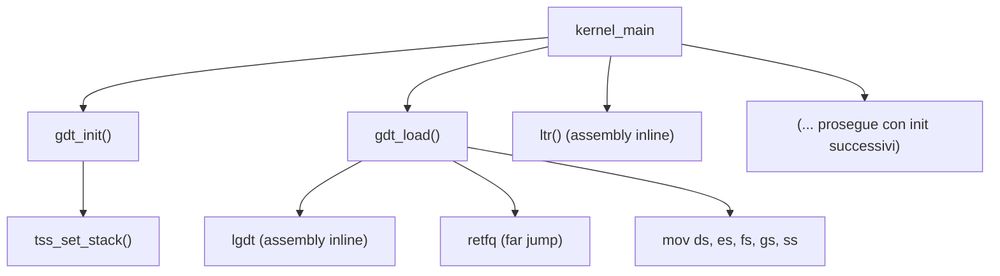

# 3. Specifica delle funzioni

## Funzioni pubbliche

### `gdt_init()`

```
void gdt_init(void)
```

| Proprietà | Valore |
|-----------|--------|
| Scopo | prepara la GDT in memoria: NULL + cod ring0 + dati ring0 + TSS |
| Parametri | nessuno |
| Restituisce | void |
| Operazioni | 1. popola array gdt_entries (40 byte) |
| | 2. popola la TSS (IST1 = stack dedicato, altri campi = 0) |
| | 3. (NON esegue lgdt — lo fa gdt_load) |
| Dipende da | `.bss` azzerato (TSS e stack devono essere in .bss) |
| Usata da | `kernel_main` (dopo seriale) |
| Chiama | (nessuna, solo calcoli su struct) |

### `gdt_load()`

```
void gdt_load(void)
```

| Proprietà | Valore |
|-----------|--------|
| Scopo | carica GDTR con `lgdt` e ricarica CS/DS/ES/SS tramite far jump |
| Parametri | nessuno (usa gdt_entries e gdt_ptr globali) |
| Restituisce | void |
| Operazioni | 1. imposta gdt_ptr.limit = sizeof(gdt) - 1 |
| | 2. imposta gdt_ptr.base = &gdt_entries |
| | 3. `lgdt [gdt_ptr]` |
| | 4. far jump (retfq) per impostare CS = 0x08 |
| | 5. mov ds/es/fs/gs/ss = 0x10 |
| Dipende da | `gdt_init()` già eseguita, TSS inizializzata |
| Usata da | `kernel_main` (dopo gdt_init) |

### `tss_set_stack(ist_index, stack_top)`

```
void tss_set_stack(int ist_index, uint64_t stack_top)
```

| Proprietà | Valore |
|-----------|--------|
| Scopo | imposta uno stack IST nella TSS |
| Parametri | `ist_index` (1-7), `stack_top` (indirizzo alto dello stack) |
| Restituisce | void |
| Operazioni | tss.ist[ist_index - 1] = stack_top |
| Dipende da | TSS inizializzata (gdt_init) |
| Usata da | `kernel_main` per configurare stack di emergenza |

### `gdt_get_tss_selector()`

```
uint16_t gdt_get_tss_selector(void)
```

| Proprietà | Valore |
|-----------|--------|
| Scopo | restituisce il selector della TSS (per ltr) |
| Parametri | nessuno |
| Restituisce | `0x18` (indice 3, RPL=0) |
| Dipende da | `gdt_init()` già eseguita |
| Usata da | caricamento TSS (istruzione `ltr`) |

## Variabili globali

### GDT (in `.bss`)

```
uint64_t gdt_entries[5];    // 40 byte (3 descrittori standard + 1 TSS a 16 byte)
```

5 entry da 8 byte ciascuna = 40 byte. La quarta entry (TSS) occupa 2 slot (16 byte). Le entry 0-3 sono usate, entry 4 è la seconda metà della TSS.

### Puntatore GDTR (in `.rodata`)

```
struct gdtr {
    uint16_t limit;    // = 39 (sizeof(gdt)-1)
    uint64_t base;     // = &gdt_entries
} __attribute__((packed));
```

### TSS (in `.bss`)

```
struct tss {
    uint32_t reserved0;
    uint64_t rsp[3];      // RSP0, RSP1, RSP2
    uint64_t reserved1;
    uint64_t ist[7];      // IST1-IST7
    uint64_t reserved2;
    uint16_t reserved3;
    uint16_t iomap_base;
} __attribute__((packed));

struct tss tss_entry;
```

### Stack IST (in `.bss`)

```
uint8_t ist_stack[4096];   // 4 KB per IST1
```

Stack separato per la gestione delle eccezioni. Quando un interrupt con IST=1 scatta, la CPU passa RSP a questo stack invece di usare lo stack corrente.

## Flusso di inizializzazione



### Nota su `ltr`

L'istruzione `ltr` (Load Task Register) carica il selector della TSS nel registro TR della CPU. Senza `ltr`, la CPU ignora la TSS e gli IST non funzionano.

`ltr` si esegue una sola volta, subito dopo `gdt_load`.

## Effetto collaterale: Limine usa già una GDT

Quando il kernel parte, Limine ha già caricato una GDT. Perché cambiarla?



La GDT di Limine è temporanea e non ha TSS. Dobbiamo sostituirla con la nostra per:
1. avere il controllo completo della CPU
2. aggiungere la TSS per gli interrupt
3. garantire che i descrittori siano esattamente come vogliamo

## Relazioni



## Rischi

| Rischio | Conseguenza | Prevenzione |
|---------|-------------|-------------|
| `gdt_init` non chiamata prima di load | GDT piena di spazzatura (se .bss non azzerato) o tutta zero | chiamare gdt_init prima di gdt_load |
| `ltr` non eseguita | TSS caricata ma non usata → IST non funzionano → interrupt crasha | eseguire ltr dopo gdt_load |
| Stack IST non valido | CPU scrive su indirizzo inesistente → page fault dentro l'interrupt | usare stack in .bss |
| `retfq` con indirizzo sbagliato | CPU salta da qualche parte → crash | caricare RIP su stack prima |
| TSS non allineata | CPU non riesce a leggere | allineamento naturale (8 byte) |
